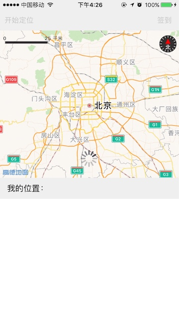
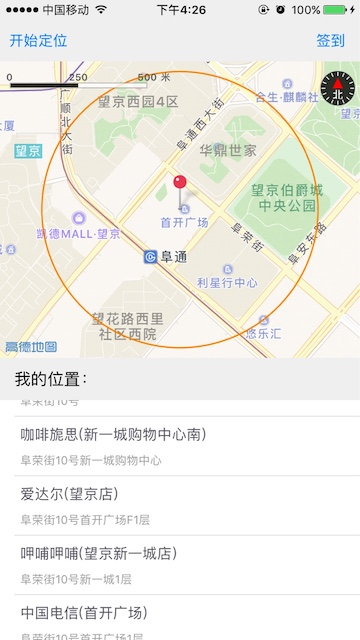
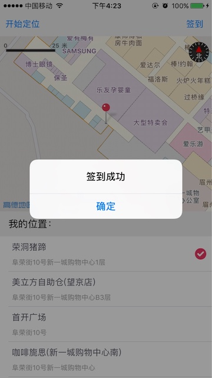

# iOS-location-checkin
实现了支持微调位置的定点签到功能。定位到自身位置后，给出周边POI列表供用户选择准确位置；支持移动地图调整位置，微调范围限定在500米以内，超过500米时弹出toast告知用户“微调距离不可超过500米”。

## 前述 ##

- 工程是基于iOS定位SDK和3D地图SDK实现的
- [高德官方网站申请key](http://lbs.amap.com/api/ios-sdk/guide/create-project/get-key/#t1).
- 查阅[定位SDK参考手册](http://a.amap.com/lbs/static/unzip/iOS_Location_Doc/index.html).
- 查阅[3D地图SDK参考手册](http://a.amap.com/lbs/static/unzip/iOS_Map_Doc/AMap_iOS_API_Doc_3D/index.html).

## 使用方法 ##

- 运行demo请先执行pod install --repo-update 安装依赖库，完成后打开.xcworkspace 文件
- 如有疑问请参阅[自动部署](http://lbs.amap.com/api/ios-sdk/guide/create-project/cocoapods/).

## demo运行效果图 ##





## 核心难点 ##

`Objective-C`

```
//开始定位
- (void)startLocation {

    [self.mapView removeOverlays:self.mapView.overlays];
    [self.mapView removeAnnotations:self.mapView.annotations];

    self.loadingView.hidden = NO;
    self.startUpdateLocationBtn.enabled = self.checkinBtn.enabled = NO;

    __weak typeof(self) weakSelf = self;
    [self.locationManager requestLocationWithReGeocode:NO completionBlock:^(CLLocation *location, AMapLocationReGeocode *regeocode, NSError *error) {

        weakSelf.loadingView.hidden = YES;
        weakSelf.startUpdateLocationBtn.enabled = weakSelf.checkinBtn.enabled = YES;

        if (error) {
            NSLog(@"定位错误:{%ld - %@};", (long)error.code, error.localizedDescription);
            return;
        }

        weakSelf.currentGPSCoordinate = location.coordinate;

        //添加定位点的大头针
        MAPointAnnotation *annotation = [[MAPointAnnotation alloc] init];
        annotation.coordinate = location.coordinate;
        [weakSelf.mapView addAnnotation:annotation];
        annotation.lockedToScreen = YES;
        annotation.lockedScreenPoint = CGPointMake(weakSelf.mapView.bounds.size.width / 2, weakSelf.mapView.bounds.size.height / 2) ;

        //添加500米的范围圈
        MACircle *circleOverlay = [MACircle circleWithCenterCoordinate:location.coordinate radius:500];
        [weakSelf.mapView addOverlay:circleOverlay];

        //设置地图
        [weakSelf.mapView setZoomLevel:15.5 animated:YES];
        [weakSelf.mapView selectAnnotation:annotation animated:YES];
        [weakSelf.mapView setCenterCoordinate:location.coordinate animated:NO];

        //搜索POI
        [weakSelf searchAllPOIAround:location.coordinate];
    }];
}

//地图区域改变完成后会调用此接口
- (void)mapView:(MAMapView *)mapView regionDidChangeAnimated:(BOOL)animated {

    if (!CLLocationCoordinate2DIsValid(self.currentGPSCoordinate)) {  //非法的时候需返回
        return;
    }

    double dis = [self distanceBetweenCoordinates:mapView.centerCoordinate and:self.currentGPSCoordinate];

    if (dis > 500) {
        [self.mapView setZoomLevel:15.5 animated:YES];
        [self.mapView setCenterCoordinate:self.currentGPSCoordinate animated:YES];
        UIAlertView *alertView = [[UIAlertView alloc] initWithTitle:@"调整距离不可超过500米" message:nil delegate:nil cancelButtonTitle:@"确定" otherButtonTitles:nil, nil];
        [alertView show];
    }

}

```

`Swift`

```

    //开始定位
    func startLocation() {
        self.mapView.removeOverlays(self.mapView.overlays)
        self.mapView.removeAnnotations(self.mapView.annotations)

        self.loadingView.isHidden = false
        self.startUpdateLocationBtn.isEnabled = false
        self.checkinBtn.isEnabled = false

        self.locationManager.requestLocation(withReGeocode: false) { [weak self] (location: CLLocation?, regeocode: AMapLocationReGeocode?, error: Error?) in

            self?.loadingView.isHidden = true
            self?.startUpdateLocationBtn.isEnabled = true
            self?.checkinBtn.isEnabled = true

            if let error = error {

                let error = error as NSError
                print("locError:{\(error.code) - \(error.localizedDescription)};")

                return
            }

            self?.currentGPSCoordinate = location?.coordinate

            //添加定位点的大头针
            let annotation: MAPointAnnotation = MAPointAnnotation.init()
            annotation.coordinate = (location?.coordinate)!
            self?.mapView.addAnnotation(annotation)
            annotation.isLockedToScreen = true
            annotation.lockedScreenPoint = CGPoint.init(x: (self?.mapView.bounds.size.width)! / 2, y: (self?.mapView.bounds.size.height)! / 2)

            //添加500米的范围圈
            let circleOverlay: MACircle = MACircle.init(center: (location?.coordinate)!, radius: 500)
            self?.mapView.add(circleOverlay)

            //设置地图
            self?.mapView.setZoomLevel(15.5, animated: true)
            self?.mapView.selectAnnotation(annotation, animated: true)
            self?.mapView.centerCoordinate = (location?.coordinate)!

            self?.searchAllPOIAround(coordinate: (location?.coordinate)!)

        }

    }

    //地图区域改变完成后会调用此接口
    func mapView(_ mapView: MAMapView!, regionDidChangeAnimated animated: Bool) {

        if CLLocationCoordinate2DIsValid(self.currentGPSCoordinate!) == false {
            return
        }

        let dis = self.distanceBetweenCoordinates(from: mapView.centerCoordinate, to: self.currentGPSCoordinate!)

        if dis > 500 {
            self.mapView.setZoomLevel(15.5, animated: true)
            self.mapView.setCenter(self.currentGPSCoordinate!, animated: true)
            let alertView: UIAlertView = UIAlertView.init(title: "调整距离不可超过500米", message: nil, delegate: nil, cancelButtonTitle: "确定")
            alertView.show()
        }

    }

```
